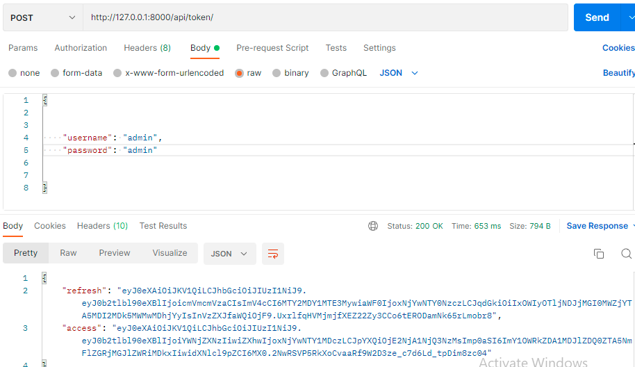
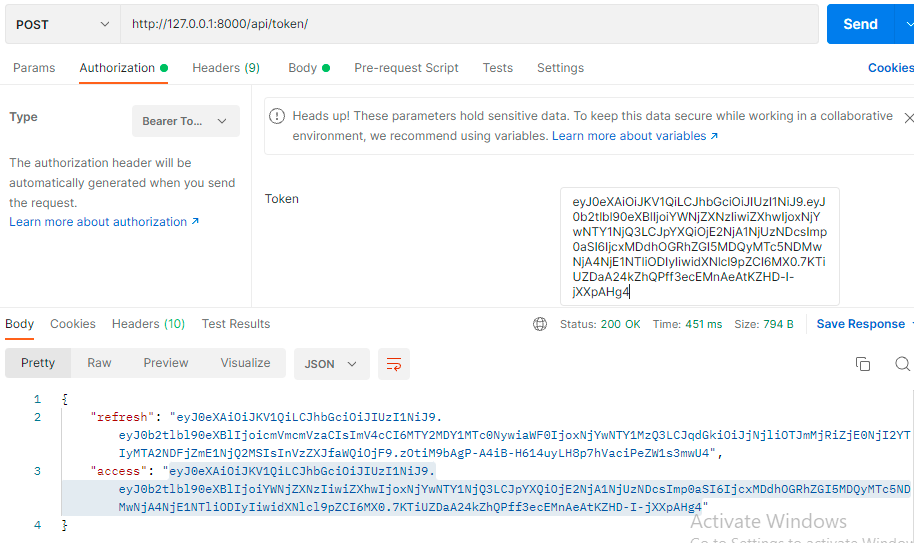
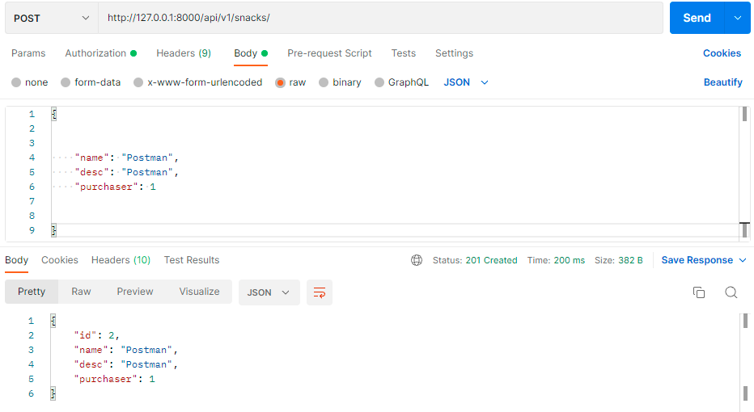
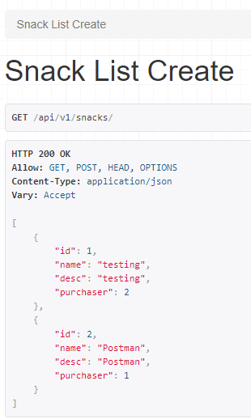

# LAB - Class 33
# Project: drf-auth
## Author: Laila Nouman
### How to run:
To run the server enter "docker-compose up" then go to "http://localhost:8000" in browser.

## Steps to manually test
- In order to test, first you need to get an access token, by doing the following:

- After getting the access token we can now post data, by first adding the access key:

- Lets post data.

- Result is:

